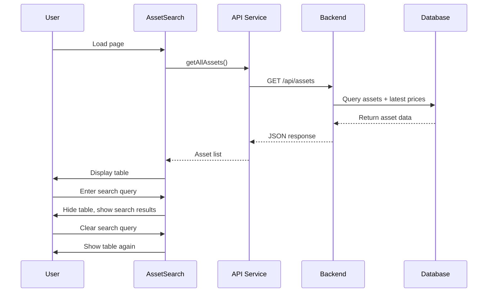

# Design Document: Assets Table Display

## Overview

This feature adds a comprehensive assets table to the Assets subpage that displays all available assets from the database. The implementation involves:

1. **Backend**: A new API endpoint `/api/assets` that returns all active assets with current prices and 1-day percentage changes
2. **Frontend**: Enhanced AssetSearch.jsx component with a table view that displays when no search query is active
3. **Data Flow**: Fetch all assets on component mount, display in table format, and toggle between table view and search results based on user input

The design follows existing patterns in the application:
- Uses the existing API service structure in `services/api.js`
- Reuses formatter utilities from `utils/formatters.js`
- Maintains consistent Tailwind CSS styling
- Preserves the existing search functionality

## Architecture

### Component Structure

```
AssetSearch.jsx (Enhanced)
├── Search Input (Existing)
├── Loading State (Existing)
├── Error Display (Existing)
├── Assets Table (New)
│   ├── Table Header
│   ├── Table Body
│   │   └── Asset Rows (clickable)
│   └── Empty State
└── Search Results (Existing)
```

### Data Flow



### API Endpoint Design

**New Endpoint**: `GET /api/assets`

**Response Format**:
```json
{
  "assets": [
    {
      "id": 1,
      "symbol": "AAPL",
      "name": "Apple Inc.",
      "asset_type": "stock",
      "exchange": "NASDAQ",
      "current_price": 178.45,
      "day_change_pct": 1.23
    }
  ]
}
```

## Components and Interfaces

### Backend Component: Assets Endpoint

**Location**: `src/api/main.py`

**Function Signature**:
```python
@app.get("/api/assets")
def get_all_assets(db: Session = Depends(get_db)):
    """Get all active assets with current prices and 1-day changes"""
```

**Implementation Logic**:
1. Query all active assets from the `assets` table
2. For each asset, fetch the latest price from `asset_prices` table
3. Calculate 1-day percentage change:
   - Get current price (most recent timestamp)
   - Get price from 24 hours ago (timestamp closest to now - 24 hours)
   - Calculate: `((current - previous) / previous) * 100`
4. Return formatted response with all asset data

**Database Queries**:
- Main query: `SELECT * FROM assets WHERE is_active = true ORDER BY symbol`
- Price query per asset: `SELECT close, timestamp FROM asset_prices WHERE asset_id = ? ORDER BY timestamp DESC LIMIT 1`
- Historical price query: `SELECT close FROM asset_prices WHERE asset_id = ? AND timestamp <= ? ORDER BY timestamp DESC LIMIT 1`

### Frontend Component: Enhanced AssetSearch

**Location**: `src/frontend/src/pages/AssetSearch.jsx`

**New State Variables**:
```javascript
const [allAssets, setAllAssets] = useState([])
const [loadingAll, setLoadingAll] = useState(false)
const [errorAll, setErrorAll] = useState(null)
```

**New Function: fetchAllAssets**:
```javascript
const fetchAllAssets = async () => {
  try {
    setLoadingAll(true)
    setErrorAll(null)
    const response = await assetApi.getAll()
    setAllAssets(response.data.assets || [])
  } catch (err) {
    setErrorAll(err.message)
    setAllAssets([])
  } finally {
    setLoadingAll(false)
  }
}
```

**Component Logic**:
- On mount: Call `fetchAllAssets()`
- When `query` is empty: Display assets table
- When `query` has value: Display search results (existing behavior)

**Table Rendering**:
```javascript
{!query && !loadingAll && !errorAll && allAssets.length > 0 && (
  <table className="w-full">
    <thead>
      <tr className="border-b">
        <th>Asset Name</th>
        <th>Symbol</th>
        <th>Current Price</th>
        <th>1D Change %</th>
      </tr>
    </thead>
    <tbody>
      {allAssets.map(asset => (
        <tr key={asset.id} onClick={() => navigate(`/assets/${asset.symbol}`)}>
          <td>{asset.name}</td>
          <td>{asset.symbol}</td>
          <td>{formatCurrency(asset.current_price)}</td>
          <td className={getChangeColor(asset.day_change_pct)}>
            {formatPercent(asset.day_change_pct)}
          </td>
        </tr>
      ))}
    </tbody>
  </table>
)}
```

### API Service Enhancement

**Location**: `src/frontend/src/services/api.js`

**New Method**:
```javascript
export const assetApi = {
  search: (query, limit = 20) => apiClient.get(`/assets/search?q=${query}&limit=${limit}`),
  getAsset: (symbol) => apiClient.get(`/assets/${symbol}`),
  getChart: (symbol) => apiClient.get(`/assets/${symbol}/chart`),
  getAll: () => apiClient.get('/assets'), // NEW
}
```

## Data Models

### Asset Response Model (Backend)

```python
class AssetWithPriceResponse(BaseModel):
    id: int
    symbol: str
    name: str
    asset_type: str
    exchange: str
    current_price: float
    day_change_pct: float | None
```

### Asset State (Frontend)

```typescript
interface Asset {
  id: number
  symbol: string
  name: string
  asset_type: string
  exchange: string
  current_price: number
  day_change_pct: number | null
}
```

### Database Schema (Existing)

**assets table**:
- `id`: Primary key
- `symbol`: Ticker symbol
- `name`: Full asset name
- `asset_type`: Type (stock, crypto, commodity, bond)
- `exchange`: Exchange name
- `is_active`: Boolean flag

**asset_prices table** (partitioned):
- `id`: Primary key
- `asset_id`: Foreign key to assets
- `timestamp`: Price timestamp
- `close`: Closing price
- `open`, `high`, `low`, `volume`: Additional price data

## Data Processing

### Price Change Calculation Algorithm

**Input**: 
- `asset_id`: Integer
- `current_timestamp`: Current datetime

**Output**: 
- `day_change_pct`: Float or None

**Algorithm**:
```python
def calculate_day_change(asset_id, db):
    # Get current price
    current_price_record = db.query(AssetPrice).filter(
        AssetPrice.asset_id == asset_id
    ).order_by(desc(AssetPrice.timestamp)).first()
    
    if not current_price_record:
        return None
    
    current_price = float(current_price_record.close)
    current_time = current_price_record.timestamp
    
    # Get price from 24 hours ago
    target_time = current_time - timedelta(hours=24)
    
    previous_price_record = db.query(AssetPrice).filter(
        AssetPrice.asset_id == asset_id,
        AssetPrice.timestamp <= target_time
    ).order_by(desc(AssetPrice.timestamp)).first()
    
    if not previous_price_record:
        return None
    
    previous_price = float(previous_price_record.close)
    
    if previous_price == 0:
        return None
    
    # Calculate percentage change
    change_pct = ((current_price - previous_price) / previous_price) * 100
    
    return round(change_pct, 2)
```

### Edge Cases

1. **No price data**: Return `current_price: 0.0` and `day_change_pct: null`
2. **No historical price**: Return current price but `day_change_pct: null`
3. **Previous price is zero**: Return `day_change_pct: null` to avoid division by zero
4. **Asset inactive**: Exclude from results (filter by `is_active = true`)
5. **Empty database**: Return empty array `{"assets": []}`


## Correctness Properties

A property is a characteristic or behavior that should hold true across all valid executions of a system—essentially, a formal statement about what the system should do. Properties serve as the bridge between human-readable specifications and machine-verifiable correctness guarantees.

### Property 1: Day Change Calculation Correctness

*For any* valid current price and 24-hour-ago price (both greater than zero), the calculated day_change_pct should equal `((current_price - price_24h_ago) / price_24h_ago) * 100` rounded to 2 decimal places.

**Validates: Requirements 2.4, 3.1**

### Property 2: Percentage Display Formatting

*For any* numeric day_change_pct value, the formatted display should:
- Include exactly 2 decimal places
- Include a percentage symbol (%)
- Include a plus sign (+) prefix if the value is positive
- Use green color class if positive
- Use red color class if negative
- Use gray color class if zero or null

**Validates: Requirements 3.2, 3.3, 3.5**

### Property 3: Currency Formatting Consistency

*For any* numeric price value, when formatted using formatCurrency(), the result should be a valid USD currency string with exactly 2 decimal places and a dollar sign prefix.

**Validates: Requirements 4.3**

### Property 4: Row Click Navigation

*For any* asset row in the table, clicking the row should trigger navigation to `/assets/{symbol}` where {symbol} is the asset's symbol.

**Validates: Requirements 4.4**

### Property 5: Error Display Behavior

*For any* API error that occurs during asset fetching, the frontend should display an error message to the user and set the error state appropriately.

**Validates: Requirements 5.2**

## Error Handling

### Backend Error Scenarios

1. **Database Connection Failure**
   - Return HTTP 500 with error message
   - Log error details for debugging

2. **No Assets Found**
   - Return HTTP 200 with empty array: `{"assets": []}`
   - This is a valid state, not an error

3. **Price Query Failure**
   - Continue processing other assets
   - Return 0.0 for current_price and null for day_change_pct
   - Log warning for the specific asset

4. **Invalid Asset Data**
   - Skip malformed records
   - Log warning with asset ID
   - Continue processing remaining assets

### Frontend Error Scenarios

1. **API Request Failure**
   - Display error message using existing error display pattern
   - Set `errorAll` state with error message
   - Preserve any previously loaded data in `allAssets` state

2. **Network Timeout**
   - Display "Request timed out" message
   - Allow user to retry by refreshing the page

3. **Empty Response**
   - Display "No assets available" message
   - This is a valid state, not an error

4. **Malformed Response Data**
   - Display "Invalid data received" error
   - Log error to console for debugging
   - Set `allAssets` to empty array

### Error Recovery

- **Retry Logic**: Not implemented initially; user can refresh page
- **Fallback Data**: Preserve previously loaded data on error
- **User Feedback**: Always display clear error messages
- **Logging**: Backend logs all errors; frontend logs to console

## Testing Strategy

This feature will use a dual testing approach combining unit tests for specific examples and edge cases with property-based tests for universal correctness properties.

### Unit Testing

Unit tests will focus on:
- **Specific examples**: Testing the API endpoint with known data
- **Edge cases**: Empty database, missing prices, null values
- **Integration points**: Component mounting, API service calls
- **Error conditions**: API failures, network errors, malformed data

**Backend Unit Tests** (pytest):
- Test `/api/assets` endpoint returns correct structure
- Test handling of assets without price data (returns 0.0)
- Test handling of assets without 24h historical data (returns null)
- Test empty database returns empty array
- Test database connection errors return 500

**Frontend Unit Tests** (Vitest + React Testing Library):
- Test component renders table when query is empty
- Test component displays loading state during fetch
- Test component displays error message on API failure
- Test component hides table when search query is entered
- Test component shows table when search query is cleared
- Test table displays correct column headers
- Test row click navigates to asset detail page

### Property-Based Testing

Property tests will verify universal properties across randomized inputs. Each test will run a minimum of 100 iterations.

**Backend Property Tests** (Hypothesis):
- **Property 1**: Day change calculation correctness
  - Generate random price pairs (current, 24h ago)
  - Verify calculation matches formula
  - Tag: **Feature: assets-table-display, Property 1: Day Change Calculation Correctness**

**Frontend Property Tests** (fast-check):
- **Property 2**: Percentage display formatting
  - Generate random percentage values (positive, negative, zero)
  - Verify formatting includes 2 decimals, %, and correct color
  - Tag: **Feature: assets-table-display, Property 2: Percentage Display Formatting**

- **Property 3**: Currency formatting consistency
  - Generate random price values
  - Verify formatCurrency produces valid USD format
  - Tag: **Feature: assets-table-display, Property 3: Currency Formatting Consistency**

- **Property 4**: Row click navigation
  - Generate random asset data
  - Verify clicking any row triggers correct navigation
  - Tag: **Feature: assets-table-display, Property 4: Row Click Navigation**

- **Property 5**: Error display behavior
  - Generate random error scenarios
  - Verify error message is displayed and state is set
  - Tag: **Feature: assets-table-display, Property 5: Error Display Behavior**

### Testing Libraries

- **Backend**: pytest, Hypothesis (property-based testing)
- **Frontend**: Vitest, React Testing Library, fast-check (property-based testing)
- **API Testing**: pytest with FastAPI TestClient
- **Mocking**: unittest.mock (backend), vi.mock (frontend)

### Test Coverage Goals

- Backend endpoint: 100% line coverage
- Frontend component: 90%+ line coverage
- All properties: Minimum 100 iterations per test
- All edge cases: Explicit unit tests
